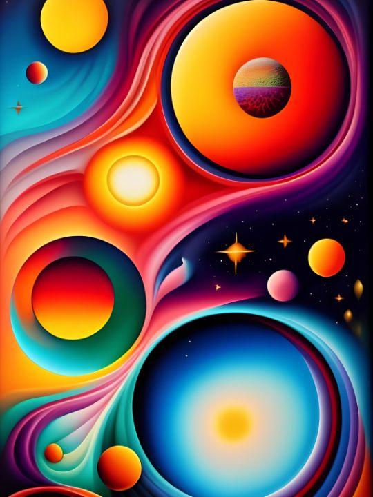
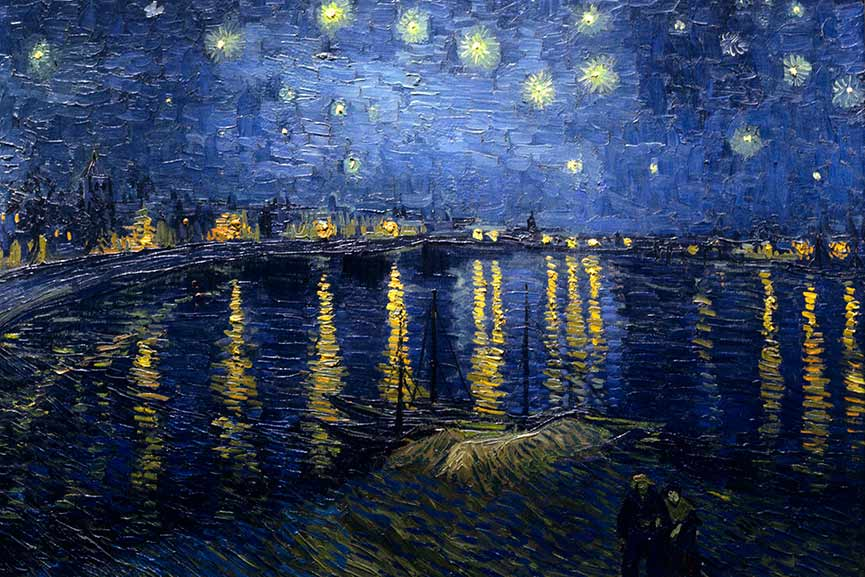
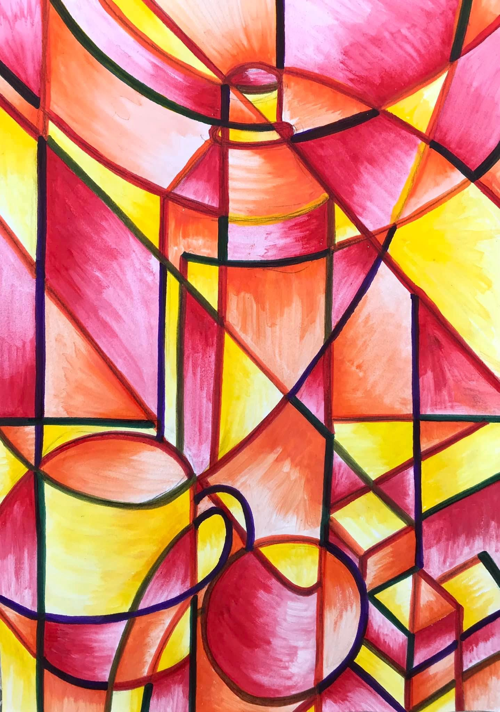

# Neural Style Transfer

Small project for [Neural Style Transfer](https://arxiv.org/abs/1508.06576) using **Pytorch**

# Usage example

<table>
  <tr>
    <td>
      <figure>
        
        <figcaption>Original image</figcaption>
      </figure>
    </td>
    <td>
      <figure>
        
        <figcaption>Style</figcaption>
      </figure>
    </td>
    <td>
      <figure>
        
        <figcaption>Generated image</figcaption>
      </figure>
    </td>
  </tr>
  <tr>
    <td>
      <figure>
        
        <figcaption>Original image</figcaption>
      </figure>
    </td>
    <td>
      <figure>
        
        <figcaption>Style</figcaption>
      </figure>
    </td>
    <td>
      <figure>
        
        <figcaption>Generated image</figcaption>
      </figure>
    </td>
  </tr>
  <tr>
    <td>
      <figure>
        
        <figcaption>Original image</figcaption>
      </figure>
    </td>
    <td>
      <figure>
        
        <figcaption>Style</figcaption>
      </figure>
    </td>
    <td>
      <figure>
        
        <figcaption>Generated image</figcaption>
      </figure>
    </td>
  </tr>
</table>